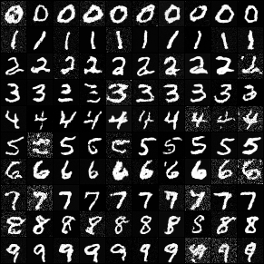
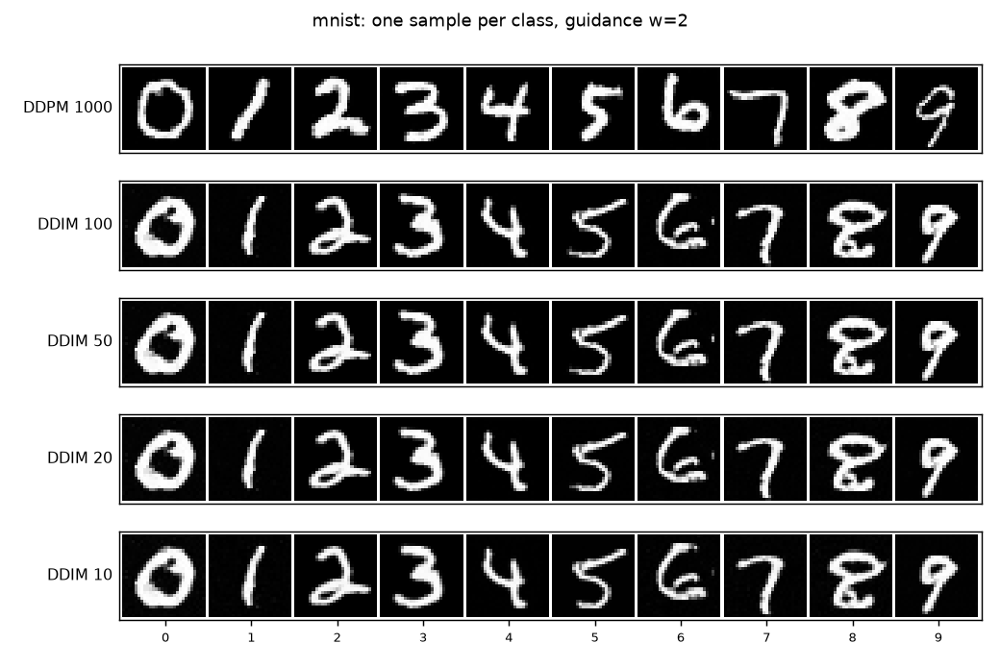
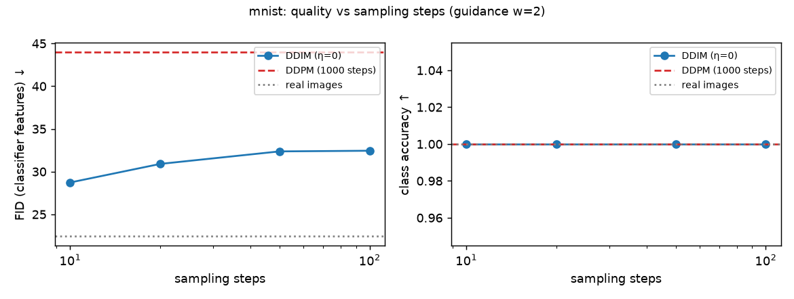
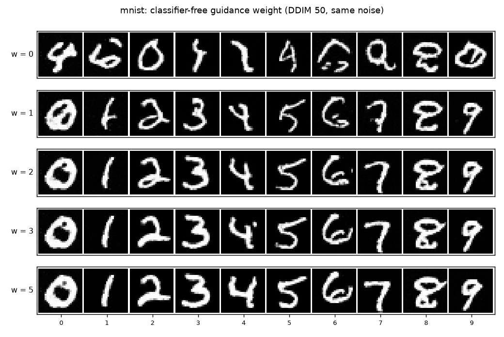
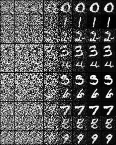
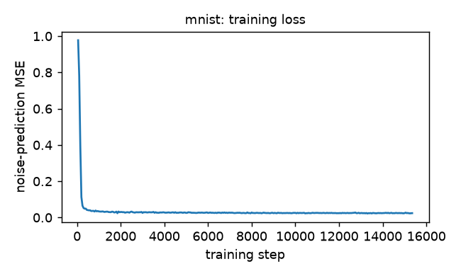
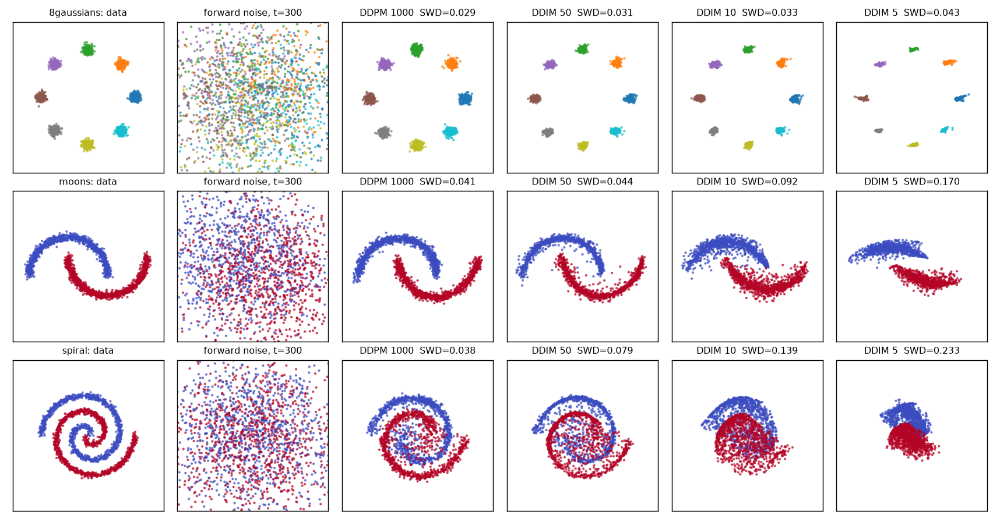
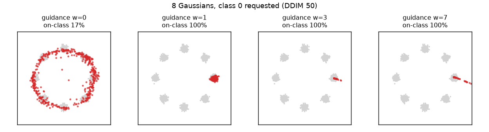

# Diffusion from scratch

[](https://github.com/dpologdvinity/diffusion-from-scratch/actions/workflows/tests.yml)

A class-conditional **DDPM** with **classifier-free guidance** and **DDIM** sampling, written from scratch in PyTorch (no `diffusers` or other diffusion libraries) and trained entirely on a laptop CPU.

## Results (MNIST)

Class-conditional samples, DDIM 50 steps, guidance w = 2. Each row is the requested class:



**DDIM matches 1000-step DDPM at 20× fewer steps.** At guidance w = 2, DDIM with 50 steps reaches the same class accuracy as DDPM with 1000 (98%) and a slightly lower FID (26.1 vs 30.0, against a real-image floor of 22.4), while sampling 16–39× faster in wall-clock time. Even 10 steps keeps 96% accuracy.

| sampler | steps | class acc ↑ | FID ↓ | KID×1000 | wall-clock speedup |
|---|---|---|---|---|---|
| DDPM | 1000 | 98% | 30.0 | -5.0 | 1× |
| DDIM | 100 | 98% | 26.7 | -21.2 | — |
| DDIM | 50 | 98% | 26.1 | -22.9 | 16–39× |
| DDIM | 20 | 97% | 25.1 | -24.0 | 95× |
| DDIM | 10 | 96% | 25.0 | -19.3 | 185× |
| real images | — | 100% | 22.4 | -32.2 | — |

N = 100 samples per config. Speedups come from a sequential benchmark on one CPU thread (batch 10). DDIM 50 was timed before and after DDPM, and the 16–39× range reflects background load changing between the two runs; the step ratio is exactly 20×. At this sample size KID is within noise for every w = 2 config (the real-image floor itself is -32), so FID and class accuracy carry the comparison.

Same starting noise, same label, different samplers. Deterministic DDIM (η = 0) gives nearly the same image at every step count. At this training stage DDIM samples show faint background speckle that DDPM's stochastic steps smooth away, even though the metrics are similar:





**Classifier-free guidance trades diversity for fidelity.** Raising w from 1 (plain conditional) to 2 lifts class accuracy from 75% to 98% and cuts FID from 96 to 26. Past that, samples stay on-class but FID worsens (41 at w = 3, 88 at w = 5) as strokes thicken and variety collapses. w = 0 is the unconditional model (11% accuracy, i.e. chance), which saw only 10% of training batches:

| guidance w (DDIM 50) | class acc ↑ | FID ↓ |
|---|---|---|
| 0 | 11% | 226.6 |
| 1 | 75% | 96.2 |
| 2 | 98% | 26.1 |
| 3 | 100% | 41.0 |
| 5 | 100% | 87.9 |



Denoising trajectory (DDIM 50, x_t from pure noise to the final sample) and the training loss of the 0.42M-parameter UNet (1,812 steps at global batch 130, about 4 epochs, 60 minutes on a shared laptop CPU):






## What's implemented

| Piece | Where | Notes |
|---|---|---|
| Noise schedule + closed-form forward process | [`ddpm/schedule.py`](ddpm/schedule.py) | linear (default) and cosine β schedules, T = 1000 |
| Noise-prediction UNet | [`ddpm/unet.py`](ddpm/unet.py) | 28→14→7, ResBlocks + GroupNorm, attention at 7×7, sinusoidal time + learned class embeddings, 0.42M params |
| Training | [`ddpm/train.py`](ddpm/train.py) | ε-prediction MSE, 10% label dropout for CFG, EMA weights, data-parallel CPU training via `torchrun` |
| DDPM sampler | [`ddpm/sampling.py`](ddpm/sampling.py) | ancestral sampling from the true posterior, 1000 steps |
| DDIM sampler | [`ddpm/sampling.py`](ddpm/sampling.py) | any step count, η ∈ [0, 1]; η = 1 with consecutive steps reduces to DDPM (tested) |
| Classifier-free guidance | [`ddpm/sampling.py`](ddpm/sampling.py) | conditional and null-label passes batched into one forward call |
| Evaluation | [`ddpm/evaluate.py`](ddpm/evaluate.py), [`ddpm/classifier.py`](ddpm/classifier.py), [`ddpm/metrics.py`](ddpm/metrics.py) | class accuracy, FID and KID in a dataset-specific classifier's feature space, wall-clock timing |
| 2D toy experiments | [`ddpm/toy.py`](ddpm/toy.py) | 8 Gaussians, two moons, spiral with an MLP denoiser |

[`NOTES.md`](NOTES.md) walks through the math (forward process, ε-prediction, DDIM's non-Markovian reverse process, why CFG works) and maps each equation to the code.

## 2D toy distributions

The same schedule, samplers, and guidance code with a small MLP denoiser. Colors are classes; each model is class-conditional.



Sliced Wasserstein distance to held-out data (lower is better; "real" is the floor from two independent draws of real data):

| dataset | DDPM 1000 | DDIM 50 | DDIM 10 | DDIM 5 | real | DDPM 1000 time | DDIM 50 time |
|---|---|---|---|---|---|---|---|
| 8gaussians | 0.029 | 0.031 | 0.033 | 0.043 | 0.017 | 34.2s | 1.4s |
| moons | 0.041 | 0.044 | 0.092 | 0.170 | 0.020 | 40.1s | 0.9s |
| spiral | 0.038 | 0.079 | 0.139 | 0.233 | 0.015 | 32.6s | 0.7s |

DDIM holds quality well down to ~10 steps on simple geometry (8 Gaussians) but degrades sooner on the spiral, where the trajectory curves more and large deterministic steps cut corners.

Classifier-free guidance on 8 Gaussians, asking for one mode. w = 0 is the unconditional model; w > 1 over-sharpens and pushes samples past the mode, the usual diversity-for-fidelity trade:



## Reproduce

```bash
uv sync                         # CPU-only PyTorch
make test                       # sampler math, schedule, CFG, UNet, metrics
make toy                        # 2D experiments (~5 min)
make train MINUTES=60           # MNIST, data-parallel over single-threaded CPU workers
make eval N=100                 # samples for every sampler config -> metrics, figures, timing
```

Variables: `DATASET=mnist|fashion`, `WORKERS`, `MINUTES`, `N`, `JOBS`; `make resume` continues from the last checkpoint. Long jobs run under `nice` with `OMP_NUM_THREADS=1`: on a contended CPU, single-threaded DDP workers sync once per step and scale far better than intra-op threads.

Larger evaluations can split the expensive DDPM run across processes; shards reproduce the unsharded samples exactly and are merged automatically:

```bash
for i in 0 1 2 3; do uv run python -m ddpm.evaluate generate --method ddpm --n 1000 --batch 50 --shard $i --num-shards 4 & done; wait
```

## Roadmap

- [x] DDPM, DDIM, classifier-free guidance, UNet, CPU data-parallel training
- [x] 2D toy experiments and MNIST evaluation (class accuracy, FID/KID, guidance sweep, timing)
- [ ] Longer MNIST training run (current model saw ~4 epochs in 60 minutes)
- [ ] FashionMNIST model and evaluation
- [ ] Larger evaluation (N = 1000 per config) for tighter FID/KID estimates
- [ ] Ablations: cosine vs linear schedule; DDIM η ∈ {0, 0.5, 1}

## Evaluation caveats

- **FID here is not comparable to published FIDs.** Inception-v3 features suit 28×28 grayscale digits poorly, so FID and KID are computed on the 64-d penultimate features of a small CNN trained on MNIST. Scores are meaningful only relative to each other and to the "real images" floor at the same sample size.
- **Small sample sizes.** Samples were generated on a shared laptop CPU, so each config uses N = 100 (the 1000-step DDPM run alone is 200k network evaluations). FID is biased upward at small N (hence the equal-N real-image floor); KID is unbiased and is the more reliable of the two here.
- **Wall-clock timings** were measured on a machine running other jobs. Step counts are the load-independent measure; the timing table confirms the ratio holds in practice.

## References

Ho et al. 2020 (DDPM) · Song et al. 2021 (DDIM) · Ho & Salimans 2022 (classifier-free guidance) · Nichol & Dhariwal 2021 (cosine schedule) · Bińkowski et al. 2018 (KID)
